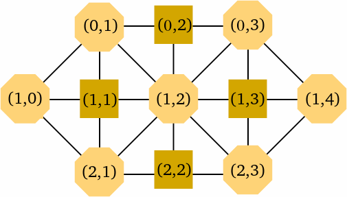

Hares and Hounds
================

+    There are two players, one representing the hounds and the other represents the hare. Each 
player takes turn to make a move. The player representing the hounds can only move one 
hound at one time. 
+	The three hounds try to corner the hare and the hare tries to escape to the left of all hounds. 
+	The hounds can move up and down, straight forward, or diagonally forward toward the right 
end of the game board. The hare can move horizontally, vertically, or diagonally in any 
direction. 
+	The hounds win if they "trap" the hare so it can no longer move. 
+	The hare wins if it "escapes" to the left of all three hounds. 
+	If the hounds move vertically ten times in a row, they are considered to be "stalling" and the 
hare wins. 




###Compile and run program

```
python hounds_and_hare.py
```

+ Choose player by typing __hare__ or __hound__
+ Select moves in the matrix form as described above
